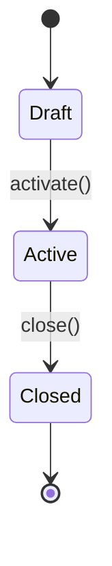
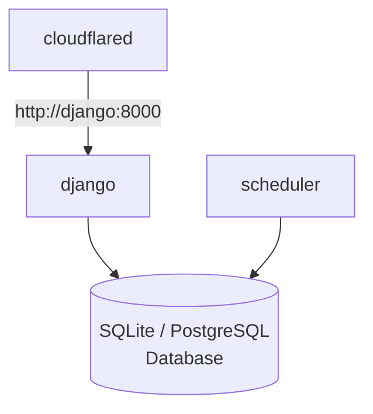

# Face Check-in

A Django web application for face-based attendance check-in with time logging.

## Features

- **Face-based Check-in**: Participants check in by showing their face to a camera
- **Face Enrollment**: Easy enrollment via photo upload or direct webcam capture
- **Session Management**: Create and manage check-in sessions with automatic open/close times
- **Real-time Recognition**: Client-side face detection using face-api.js
- **Kiosk Mode**: Full-screen tablet-optimized check-in interface
- **Reports**: View and export attendance reports

## Tech Stack

- **Backend**: Django 5.x (Python 3.12)
- **Frontend**: AlpineJS + HTMX, served via Django templates
- **Face Recognition**: face-api.js (TensorFlow.js-based)
- **Database**: SQLite (development) or PostgreSQL (production)
- **Tunnel**: Cloudflare cloudflared (provides HTTPS)
- **Deployment**: Docker & Docker Compose

## Session State Machine

Sessions follow a state machine:



- **Draft**: Session created but not active
- **Active**: Session is live and accepting check-ins
- **Closed**: Session has ended

State transitions are enforced by the model methods:
- `session.activate()` — Transition from Draft to Active
- `session.close()` — Transition from Active to Closed

## Quick Start (Development)

### Prerequisites

- Python 3.12+
- uv package manager
- Modern browser with webcam support

### Setup

1. **Clone the repository**

2. **Install dependencies**
   ```bash
   uv sync
   ```

3. **Copy environment file**
   ```bash
   cp .env.example .env
   ```

4. **Edit `.env` with your settings** (see [Configuration Reference](#configuration-reference) below)

5. **Run migrations**
   ```bash
   uv run python manage.py migrate
   ```

6. **Create superuser**
   ```bash
   uv run python manage.py createsuperuser
   ```

7. **Start development server**
   ```bash
   uv run python manage.py runserver
   ```

8. **Access the application**
   - Admin panel: http://localhost:8000/admin/
   - Kiosk mode: http://localhost:8000/kiosk/\<session_id\>/

## Configuration Reference

### Environment Variables

| Variable | Default | Description |
|----------|---------|-------------|
| `SECRET_KEY` | (required) | Django secret key |
| `DEBUG` | `False` | Enable debug mode |
| `ALLOWED_HOSTS` | `*` | Comma-separated allowed hosts |
| `DATABASE_URL` | SQLite | Database connection string |
| `POSTGRES_USER` | `face` | PostgreSQL username (Docker postgres profile) |
| `POSTGRES_PASSWORD` | `face` | PostgreSQL password (Docker postgres profile) |
| `POSTGRES_DB` | `face_checkin` | PostgreSQL database name (Docker postgres profile) |
| `USE_S3` | `False` | Use Backblaze B2 for file storage |
| `AWS_*` | — | B2 credentials (when `USE_S3=True`) |
| `TIME_ZONE` | `UTC` | IANA timezone for admin/template display |
| `FACE_MATCH_THRESHOLD` | `0.6` | Cosine similarity threshold (0.0–1.0) |
| `CSRF_TRUSTED_ORIGINS` | (none) | Comma-separated HTTPS origins for CSRF (e.g., `https://example.com`) |
| `TUNNEL_TOKEN` | (none) | Cloudflare tunnel token (required for cloudflared Docker service) |
| `DJANGO_SUPERUSER_USERNAME` | (none) | Auto-created superuser username on first container start |
| `DJANGO_SUPERUSER_EMAIL` | (none) | Auto-created superuser email on first container start |
| `DJANGO_SUPERUSER_PASSWORD` | (none) | Auto-created superuser password on first container start |

### Example `.env` for Production

> **Note**: `DATABASE_URL` is read directly from `.env` by both the Django container and the scheduler. Set it to match your chosen Docker profile.

```bash
# Security
SECRET_KEY=your-secret-key-here
DEBUG=False
ALLOWED_HOSTS=yourdomain.com,www.yourdomain.com

# Database — choose one to match your Docker profile:
#   sqlite profile:   DATABASE_URL=sqlite:////data/db.sqlite3
#   postgres profile: DATABASE_URL=postgresql://face:face@db:5432/face_checkin
DATABASE_URL=sqlite:////data/db.sqlite3

# Timezone
TIME_ZONE=Asia/Bangkok

# Face Matching
FACE_MATCH_THRESHOLD=0.6

# CSRF (required when behind Cloudflare or reverse proxy)
CSRF_TRUSTED_ORIGINS=https://yourdomain.com

# Cloudflare Tunnel
TUNNEL_TOKEN=your-tunnel-token-here
```

### Face Matching Threshold Tuning

The `FACE_MATCH_THRESHOLD` controls how strict the face matching is:

- **Lower (0.4–0.5)**: More permissive, may accept different people
- **Default (0.6)**: Balanced accuracy
- **Higher (0.7–0.8)**: Stricter, may reject legitimate matches

## Usage Guide

### 1. Create Face Groups

1. Log in to the admin panel: http://localhost/admin/
2. Navigate to **Face groups** → Add Face group
3. Enter a name (e.g., "Class A Students")
4. Save

### 2. Enroll Faces

You can enroll faces in two ways:

**Option A: Photo Upload**
1. Open a Face group in admin
2. Add new Face
3. Enter participant details (name, custom_id)
4. Upload a photo
5. Save

**Option B: Webcam Capture**
1. Open a Face in admin
2. Click "Capture from webcam"
3. Allow camera access
4. Position face in frame
5. Click "Capture" to take photo
6. The photo will be saved automatically

### 3. Create Classes

1. Navigate to **Classes** → Add Class
2. Enter class name
3. Select the associated Face group
4. Add tags (optional)
5. Save

### 4. Manage Sessions

1. Navigate to **Sessions** (from the main sidebar)
2. Click on a class to view its sessions
3. Create a new session:
   - Set session name
   - Set scheduled start time
   - Set auto-close time (optional)
4. Activate the session when ready
5. The session will automatically close at the specified time

### 5. Launch Kiosk Mode

1. Find an active session
2. Click the kiosk link or visit: `/kiosk/<session_id>/`
3. The kiosk page will open in full-screen mode
4. Position the camera so faces are detected
5. Participants can check in by showing their face

### 6. View Reports

1. Navigate to **Sessions** → Select a class
2. Click on a session
3. View the check-in report with:
   - Participant names
   - Check-in times
   - Match status (matched/unmatched)
4. Export to CSV if needed

## Production Deployment with Docker

### Prerequisites

- Docker & Docker Compose
- At least 1GB RAM
- Modern browser with webcam support (for kiosk devices)

### Quick Start (Docker)

1. **Clone and configure**
   ```bash
   cp .env.example .env
   ```

2. **Edit `.env` with production settings**, including `DATABASE_URL` to match your chosen profile:
   - SQLite: `DATABASE_URL=sqlite:////data/db.sqlite3`
   - PostgreSQL: `DATABASE_URL=postgresql://face:face@db:5432/face_checkin`

3. **Start with SQLite (recommended for small deployments)**
   ```bash
   docker compose --profile sqlite up --build
   ```

4. **Or start with PostgreSQL**
   ```bash
   docker compose --profile postgres up --build
   ```

5. **Create superuser**
   ```bash
   docker compose exec django python manage.py createsuperuser
   ```

6. **Access the application**
   - Application: http://localhost
   - Health check: http://localhost/health/

### Docker Profiles

The application supports two profiles:

| Profile | Description | Use Case |
|---------|-------------|----------|
| `sqlite` | SQLite database on persistent volume | Small deployments, development |
| `postgres` | PostgreSQL database | Production with multiple users |

### Service Architecture



## Cloudflare Tunnel Setup

Cloudflare tunnels provide HTTPS for your self-hosted application without exposing ports or configuring SSL certificates.

### Option 1: Named Tunnel (Recommended for Production)

1. **Install cloudflared**
   ```bash
   # macOS
   brew install cloudflare/cloudflare/cloudflared

   # Linux
   curl -L https://github.com/cloudflare/cloudflared/releases/latest/download/cloudflared-linux-amd64 -o cloudflared
   chmod +x cloudflared
   ```

2. **Create a tunnel**
   ```bash
   cloudflared tunnel create face-checkin
   ```

3. **Configure the tunnel**

   **If running cloudflared locally (outside Docker):**
   ```yaml
   # ~/.cloudflared/config.yml
   tunnel: <your-tunnel-uuid>
   credentials-file: /root/.cloudflared/<your-tunnel-uuid>.json

   ingress:
     - hostname: your-domain.example.com
       service: http://localhost:8000
     - service: http_status:404
   ```

   **If running cloudflared inside Docker (as in this project's setup):**
   The `cloudflared` service connects to Django via the Docker service name `django`, which is the same regardless of which database profile is active:
   - Both profiles: connects to `http://django:8000`

4. **Route the tunnel to your domain**
   ```bash
   cloudflared tunnel route dns face-checkin your-domain.example.com
   ```

5. **Get the tunnel token** and add it to your `.env` file:
   ```bash
   TUNNEL_TOKEN=<your-tunnel-token>
   ```

6. **Run with Docker**
   ```bash
   docker compose --profile sqlite up --build
   ```

### Option 2: Quick Tunnel (Testing Only)

For quick testing without a domain:

1. **Run cloudflared directly**
   ```bash
   cloudflared tunnel --url http://localhost:8000
   ```

2. **Use the provided HTTPS URL** (temporary, changes on restart)

### Important: Django Settings Behind Cloudflare

The application is configured to work behind Cloudflare with these settings in `face_checkin/settings/production.py`:

```python
# Trust the proxy (Cloudflared) for the original protocol
USE_X_FORWARDED_HOST = True
SECURE_PROXY_SSL_HEADER = ("HTTP_X_FORWARDED_PROTO", "https")
```

You must also add your domain to `CSRF_TRUSTED_ORIGINS` in your `.env` file:

```bash
CSRF_TRUSTED_ORIGINS=https://your-domain.example.com
```

For multiple domains, comma-separate them:
```bash
CSRF_TRUSTED_ORIGINS=https://example.com,https://www.example.com
```

### Troubleshooting Cloudflare Tunnel

1. **Redirect loop errors**: Ensure `CSRF_TRUSTED_ORIGINS` includes your domain
2. **Tunnel won't connect**: Check that `TUNNEL_TOKEN` is correct in `.env`
3. **Health check fails**: Ensure Django is running and responding on port 8000

```bash
# Check tunnel logs
docker compose logs cloudflared

# Check Django logs
docker compose logs django
```

## Face-api.js Models

The required face recognition models are already included in the repository:

- **SSD MobileNetV1**: Face detection model
- **Face Landmark 68**: Facial landmark detection
- **Face Recognition**: Face embedding extraction

Models are located in: `static/js/face-api/models/`

No additional download is required.

## API Endpoints

| Method | URL | Description |
|--------|-----|-------------|
| `POST` | `/api/checkin/match/` | Submit face embedding for matching |
| `GET` | `/api/sessions/<pk>/` | Get session details |
| `GET` | `/api/sessions/<pk>/report/` | Get session check-in report |
| `GET` | `/kiosk/<session_id>/` | Kiosk check-in page |
| `GET` | `/health/` | Health check endpoint |

## Management Commands

The application includes several management commands:

### auto_close_sessions

Closes all active sessions whose `auto_close_at` time has passed.

```bash
uv run python manage.py auto_close_sessions
```

In Docker:
```bash
docker compose exec django python manage.py auto_close_sessions
```

### auto_open_sessions

Re-opens all closed sessions whose `scheduled_at` time has passed.

```bash
uv run python manage.py auto_open_sessions
```

In Docker:
```bash
docker compose exec django python manage.py auto_open_sessions
```

### Scheduler Service

The Docker deployment includes a `scheduler` service that automatically runs these commands every 60 seconds. This is configured in `docker/scheduler.sh`.

## Testing

Run the test suite:

```bash
uv run pytest
```

Run with coverage:

```bash
uv run pytest --cov
```

## Project Structure

```
face-checkin/
├── apps/
│   ├── faces/          # FaceGroup + Face models
│   ├── classes/        # Class + ClassTag models
│   ├── sessions/       # Session model + management
│   └── checkin/        # CheckIn model + matching + kiosk
├── face_checkin/       # Django project settings
├── templates/          # HTML templates
├── static/             # CSS, JS, face-api models
├── docker/             # Docker scripts
├── docker-compose.yml  # Container orchestration
├── Dockerfile          # Container image
└── README.md           # This file
```

## Troubleshooting

### Camera Not Working

1. Ensure the browser has camera permissions
2. Use HTTPS (required for camera access in production)
3. Try a different browser (Chrome recommended)

### Face Not Recognized

1. Ensure good lighting on the face
2. Position face directly in front of camera
3. Adjust `FACE_MATCH_THRESHOLD` in settings
4. Ensure face is properly enrolled with clear photo

### Database Issues

1. Check that the database volume is properly mounted
2. For SQLite: ensure `/data` directory is writable
3. For PostgreSQL: verify database credentials

### Docker Issues

1. Check logs: `docker compose logs <service>`
2. Ensure ports are not already in use
3. Restart services: `docker compose restart <service>`

### Common Docker Commands

```bash
# View logs
docker compose logs -f django
docker compose logs -f scheduler

# Restart service
docker compose restart django

# Stop all services
docker compose --profile sqlite down

# Rebuild and start
docker compose --profile sqlite up --build
```

## Additional Documentation

- [SPECS.md](SPECS.md) — Detailed specifications
- [AGENTS.md](AGENTS.md) — Developer guide for AI agents

## License

MIT License
