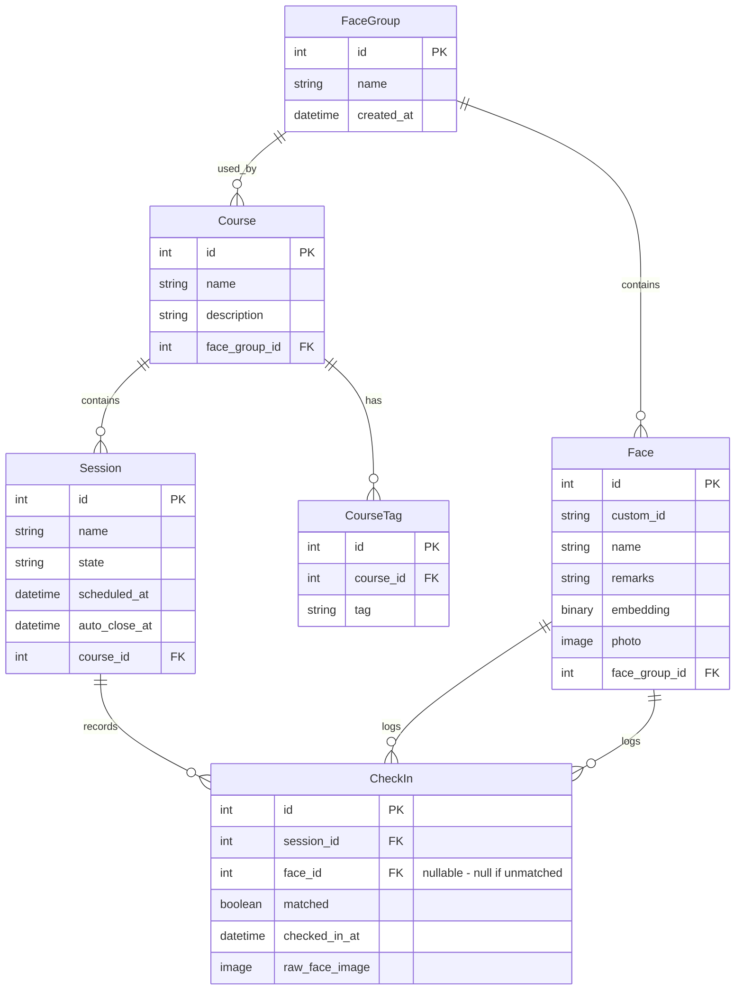

# Face Check-in Spec

## App info

- A web app for face-based check-in with time attendance logging

## Tech stack

- **Frontend**: AlpineJS + HTMX, served via Django templates
  - Lightweight, minimal JS knowledge required
  - Works well on low-powered kiosk devices
- **Backend**: Django (Python)
  - Django built-in auth for admin authentication
- **Face recognition**: face-api.js (TensorFlow.js-based)
  - Runs entirely on-device (in the browser) for both face detection and embedding extraction
  - Server performs embedding comparison/matching only

## User stories

### Admins

Admins can:

- Log in to admin panel using Django built-in authentication (username/password).
- **Manage face groups:**
  - Face groups are collections of faces (participants).
  - Each face maps to an ID (UUID by default, customisable), name, and remarks.
    - An ID is only unique within a face group.
  - Enroll faces via:
    - **Photo upload**: Upload one or more photos per participant through the admin panel.
    - **Webcam capture**: Capture face photos directly from a webcam in the admin panel.
  - Edit or remove enrolled faces.
- **Manage classes:**
  - A class can contain multiple sessions.
  - A class is tied to a single face group.
  - A class can be tagged with multiple tags for organisation and filtering.
- **Manage sessions in a class:**
  - A session is a 'slot' for check-in.
  - Session lifecycle states:
    - **Draft**: Session created but not yet active. Can be edited.
    - **Active**: Session is live and accepting check-ins on the kiosk.
    - **Closed**: Session is ended. No more check-ins accepted.
  - A session can have an optional **auto-close time**. Once activated, the session will automatically transition to Closed when this time is reached.
  - Admins can manually transition sessions: Draft → Active → Closed.
- **Launch a session** inside a web browser on the check-in kiosk (e.g., a tablet with a front-facing camera) to start a check-in process.
- **Pull session reports**: List of participants and the time(s) they checked in.

### Participants

Participants are stored as faces inside a face group. Participants cannot log in. They only have to show their face at the check-in kiosk.

## Kiosk check-in flow

1. Admin opens the session URL on the kiosk device's browser.
2. The kiosk shows a live camera preview from the front-facing camera.
3. The participant taps a **"Take Photo"** button to capture their face.
4. The kiosk captures the photo and:
   a. Extracts the face embedding on-device using face-api.js.
   b. Sends the embedding **and the raw face image** to the server for matching against the session's face group.
5. **If a match is found:**
   - Server logs the check-in (participant ID, timestamp) and stores the raw face image for audit.
   - Kiosk displays a confirmation message with the participant's name.
   - If the participant has already checked in during this session, kiosk shows "You have already checked in" message. The server still logs the duplicate check-in.
6. **If no match is found:**
   - Kiosk displays a "Face not recognised" message.
   - Server logs the unrecognised attempt and stores the raw face image for audit.
7. The kiosk returns to the camera preview, ready for the next participant.

## Data model

## Key API endpoints

| Method | Endpoint | Description |
|--------|----------|-------------|
| POST | `/api/checkin/match/` | Receive face embedding + raw face image, match against face group, log check-in |
| GET | `/api/sessions/{id}/` | Get session details and state |
| GET | `/api/sessions/{id}/report/` | Get check-in report for a session |

> Note: Most admin CRUD operations (face groups, faces, classes, sessions) will be handled through Django's admin interface or Django-template-based views with HTMX, rather than a separate REST API.

## Technical considerations

- **Face embedding on-device**: Face detection and embedding extraction are done entirely in the browser using face-api.js. The raw face image is also sent to the server alongside the embedding for audit storage.
- **Face matching on server**: The browser computes the face embedding locally, then sends it to the server. The server compares it against stored embeddings using cosine similarity. A configurable similarity threshold determines match/no-match.
- **Embedding storage**: Face embeddings are stored in the database alongside face records. During a check-in request, the server loads the relevant face group's embeddings for comparison.
- **Duplicate check-ins**: All check-ins are logged server-side regardless of duplicates (each with its own raw face image). The kiosk UI shows a distinct message for repeat check-ins within the same session.
- **Audit trail**: Raw face images are stored for every check-in attempt (both matched and unmatched) to support post-hoc auditing and dispute resolution.
- **Session auto-close**: Sessions with an auto-close time are automatically transitioned to Closed state via a background task (e.g., Django management command, Celery task, or a simple scheduled check).
- **No liveness detection**: Anti-spoofing is out of scope for the initial version.

## Deployment

The app is deployed as a Docker container using Docker Compose.

### Container architecture

- **Django app container**: Serves the web application via `gunicorn`.
- **Database**: Configurable via Docker Compose profiles:
  - **SQLite profile** (default): No separate database container. SQLite file stored on a persistent volume. Simple and lightweight.
  - **PostgreSQL profile**: Adds a PostgreSQL container. Better for concurrent access and production workloads.
- **Reverse proxy**: Caddy container for automatic HTTPS and static file serving.

### Docker Compose profiles

The `docker-compose.yml` supports two database profiles, selectable via environment variable or compose profile flag:

- `docker compose --profile sqlite up` — Runs Django + Caddy with SQLite (default).
- `docker compose --profile postgres up` — Runs Django + Caddy + PostgreSQL.

Django's `DATABASE_URL` environment variable determines which database backend is used at the application level.

### Image and file storage

- **Audit face images** and **enrolled face photos** are stored in Backblaze B2 (S3-compatible object storage).
- Django uses `django-storages` with the S3 backend, configured via environment variables (`AWS_ACCESS_KEY_ID`, `AWS_SECRET_ACCESS_KEY`, `AWS_STORAGE_BUCKET_NAME`, `AWS_S3_ENDPOINT_URL`).
- face-api.js model files are served as static assets from the Django application.

### Kiosk access

- The kiosk accesses the app via a network URL (local or public depending on deployment).
- For local deployments, the kiosk and server must be on the same network.
- HTTPS is required for camera access on the kiosk (handled by Caddy).
